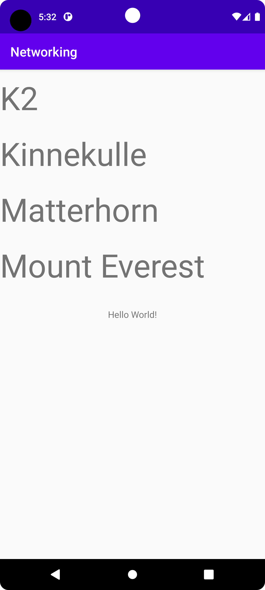

# Rapport

To begin with it is worth mentioning that the base project
refused to run on my machine, the way to fix this ended up being changing the
sdk version as well as changing to java 8. this was done in the build.gradle (module: app) file
and was done with the following code:

```
    compileOptions {
        sourceCompatibility JavaVersion.VERSION_1_8
        targetCompatibility JavaVersion.VERSION_1_8
    }
```
as well as changing the compileSdkVersion and targetedSdkVersion variables.
Should there be trouble running the program, that may be a possible cause.


As for the actual project, to begin with a recyclerview was added.
Code was added in postExecute to get actual data from the json file.
The code at the time looked as such:
```
    Type type = new TypeToken<ArrayList<Mountain>>() {}.getType();
    listOfMountains = gson.fromJson(json, type);
    for (Mountain m : listOfMountains){
            Log.d("waow", m.toString());
    }
```
Here the data from the json file is put into a list, and then to make sure data is being
gathered, it will log all of said data. For this to work a simple Mountain class was also
created. Which has the same variables as the mountains in the json file, together with getters
and setters as well as a toString function, which prints the data.

As for displaying the data in the recyclerview, a custom adapter was created which
also includes a viewHolder.
The two main functions in the custom adapter is OnCreateViewHolder and OnBindViewHolder.
They look as follows:
```
    public CustomViewHolder onCreateViewHolder(@NonNull ViewGroup parent, int viewType) {
        View v = LayoutInflater.from(parent.getContext()).inflate(R.layout.vertical_layout,parent,false);
        return new CustomViewHolder(v);
    }
```
Upon being called, creates a view with vertical_layout as layout

```
    public void onBindViewHolder(@NonNull CustomViewHolder holder, int position) {
        Mountain m = mountains.get(position);
        holder.name.setText(m.getName());
    }
```
Upon being called, sets the text in the viewholder to equal the name of the mountain at
its own corresponding position in listOfMountains.

Lastly some code was added in MainActivity in both onCreate and postExecute.
They look as follows:
```
    protected void onCreate(Bundle savedInstanceState) {
        super.onCreate(savedInstanceState);
        setContentView(R.layout.activity_main);
        recView = findViewById(R.id.recView);
        customAdapter = new CustomAdapter(listOfMountains);
        recView.setAdapter(customAdapter);
        recView.setLayoutManager(new LinearLayoutManager(getApplicationContext()));
        new JsonTask(this).execute(JSON_URL);
    }
```
The recyclerView is identified using id, then it has the custom adapter set as its adapter.
Finally one of the base layout managers is set before JsonTask executes.

```
    public void onPostExecute(String json)
    {
        Type type = new TypeToken<ArrayList<Mountain>>() {}.getType();
        listOfMountains = gson.fromJson(json, type);
        customAdapter.UpdateList(listOfMountains);
        customAdapter.notifyDataSetChanged();
    }
```
Aside from what was mentioned earlier, a UpdateList method was added in the custom adapter.
This is because when a list is overridden notifyDataSetChanged cannot pick this up.
Meaning without this the adapter will continue to think the list is empty.
While there would be other workarounds for this, this one was chosen over something
like creating the adapter in postExecute, as that would potentially lead to a great deal of trash,
should one work further on the project.

All this together looks like:

